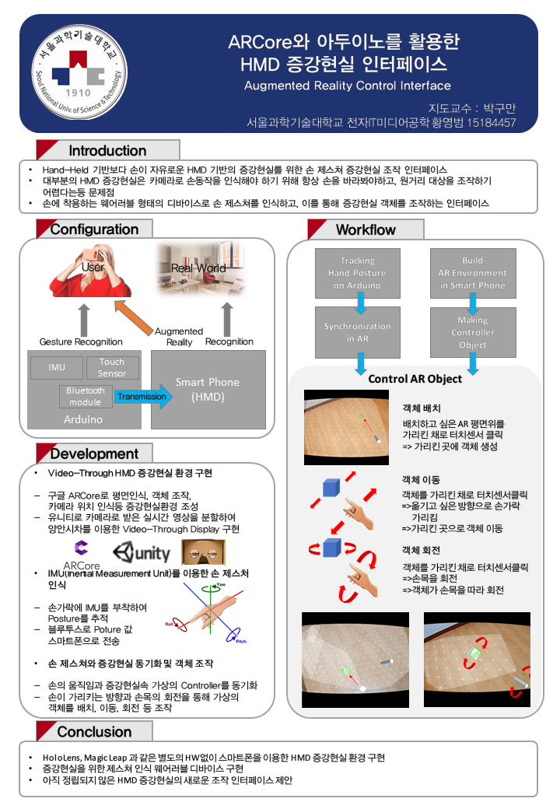

Unity를 활용한 증강현실 인터페이스
===

#### 구현 영상 및 참고
https://www.notion.so/Unity-4f4dcf4d118e44c5afd81e7bc1a0e283

## 소개
양손이 자유로운 HMD 증강현실 환경의 텍스트 입력과 객체조작을 위한 인터페이스

</img>

</img>

## 개발동기
홀로렌즈같은 AR글래스들은 입력을 하기 위해 손을 카메라로 비추기 위해 팔을 쭉 뻗고 있어야 하는 것이 상당히 불편했다. 그리고 문자를 입력하려면 음성인식이나 가상 키보드를 생성해야 했는데 AR글래스를 위한 적절한 문자 입력 방식이 아니라고 생각했다.

그렇지만 기존처럼 손동작을 이용하여 증강현실 인터페이스를 만드는 것은 맞다고 생각했다

- AR글래스(ex.홀로렌즈)의 제스쳐를 이용한 입력 인터페이스의 불편함
- AR글래스를 위한 적잘한 문자 입력 인터페이스 필요

> **팔을 쭉 뻗지 않은 채로 객체를 조작하고, PC의 키보드처럼 AR글래스에 어울리는 입력방법을 갖는 인터페이스를 개발하고자 했다**